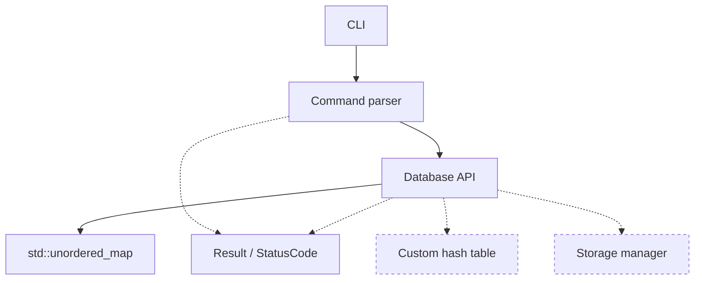

# MiniDB

An educational persistent key-value database engine built from scratch in modern C++20.

MiniDB is a learning project. It implements the mechanisms a real storage engine
depends on — a hash table, a binary on-disk format, a write-ahead log, crash
recovery, an LRU cache, transactions and thread-safe access — at a size that can
be read and understood in an afternoon. It is not a production database, and the
[Limitations](#limitations) section says plainly what it does not do.

> **Current state:** MiniDB runs entirely in memory. Nothing is written to disk
> yet — data is lost when the session ends. Persistence arrives in Milestone 3.

## Status

Built in milestones, each one a working program.

- [x] **Milestone 0** — build system, warning policy, test harness, CI
- [x] **Milestone 1** — in-memory database, command parser, interactive CLI
- [ ] Milestone 2 — custom hash table (replaces `std::unordered_map`)
- [ ] Milestone 3 — persistence
- [ ] Milestone 4 — write-ahead log
- [ ] Milestone 5 — crash recovery
- [ ] Milestone 6 — LRU cache
- [ ] Milestone 7 — transactions
- [ ] Milestone 8 — concurrency
- [ ] Milestone 9 — benchmarks

## What works today

| Command | Behaviour |
| --- | --- |
| `SET <key> <value>` | Stores a value, replacing any existing one. The value may contain spaces. |
| `GET <key>` | Prints the value, or `NOT_FOUND`. |
| `DELETE <key>` | Removes a key. Prints `NOT_FOUND` if it was not there. |
| `EXISTS <key>` | Prints `true` or `false`. |
| `KEYS` | Lists every key, sorted. Prints `(empty)` when there are none. |
| `CLEAR` | Removes every key. |
| `HELP` | Lists the commands. |
| `EXIT` | Ends the session. End-of-input works too. |

Command names are case-insensitive; keys and values are not.

## Requirements

- A C++20 compiler: GCC 10+, Clang 12+, or MSVC 19.29+ (Visual Studio 2019 16.10+)
- CMake 3.20 or newer

MiniDB has no third-party dependencies. It configures and builds offline.

## Quick start

```bash
cmake -S . -B build
cmake --build build
ctest --test-dir build --output-on-failure
```

Then start a session:

```bash
./build/minidb
```

### Build options

| Option | Default | Effect |
| --- | --- | --- |
| `MINIDB_BUILD_TESTS` | `ON` | Build the test suite |
| `MINIDB_WARNINGS_AS_ERRORS` | `OFF` | Fail the build on any compiler warning (CI sets this to `ON`) |

For a release build:

```bash
cmake -S . -B build -DCMAKE_BUILD_TYPE=Release
cmake --build build
```

## Example session

```text
$ ./build/minidb
MiniDB v0.1.0
In-memory only: nothing is written to disk yet.
Type HELP for the command list.

MiniDB> SET name Aarya
OK

MiniDB> GET name
Aarya

MiniDB> SET name Aarya Lalan
OK

MiniDB> GET name
Aarya Lalan

MiniDB> SET age 18
OK

MiniDB> KEYS
age
name

MiniDB> EXISTS age
true

MiniDB> DELETE age
OK

MiniDB> GET age
NOT_FOUND

MiniDB> GET
INVALID_ARGUMENT: GET requires a key

MiniDB> FROBNICATE x
INVALID_ARGUMENT: unknown command 'FROBNICATE'; type HELP for the list

MiniDB> EXIT
Goodbye!
```

## Architecture



Solid arrows exist today; dashed boxes are later milestones.

Three pieces, each with one job:

- **`cli/main.cpp`** — reads lines, prints replies, and nothing else. It owns
  the wording of `OK`, `true`/`false` and the sorted `KEYS` output.
- **`command_parser`** — turns a line of text into a `Command`, or into a
  `Result` explaining why it is not one. Stateless free function.
- **`Database`** — stores the data. Knows nothing about terminals or syntax.

Both the parser and the database report problems through the same `Result` /
`StatusCode` pair from Milestone 0, so the CLI has one error model to render.

## Complexity

As provided by `std::unordered_map` in Milestone 1:

| Operation | Complexity |
| --- | --- |
| `SET` | Average O(1), worst case O(n) |
| `GET` | Average O(1), worst case O(n) |
| `DELETE` | Average O(1), worst case O(n) |
| `EXISTS` | Average O(1), worst case O(n) |
| `KEYS` | O(n) |
| `CLEAR` | O(n) |
| `size` | O(1) |

These averages are **expected** values, not guarantees. A lookup degrades toward
O(n) when many keys hash into the same bucket. The standard library keeps that
rare by rehashing to bound the load factor, but unlucky or adversarial key sets
can still cause it. `KEYS` as printed by the CLI is O(n log n), because the CLI
sorts for readable output; `Database::keys()` itself is O(n).

## Testing

Every test file compiles to its own executable and registers as its own CTest
test, so one crashing test cannot take down the rest of the suite.

```bash
ctest --test-dir build --output-on-failure
```

To run a single test verbosely:

```bash
ctest --test-dir build -R test_database -V
```

| Suite | Covers |
| --- | --- |
| `test_database` | Every operation, empty state, overwrites, size limits, binary values, 1000-key stress |
| `test_command_parser` | Every command, spaces in values, case handling, missing and extra arguments, unknown commands |
| `test_result` | The `Result` / `StatusCode` error model |

Tests use a small in-repo framework (`tests/test_framework.hpp`) rather than a
third-party library. The reasoning is in
[docs/DESIGN_DECISIONS.md](docs/DESIGN_DECISIONS.md).

## Limitations

As of Milestone 1, MiniDB does **not**:

- Persist anything. Data lives in memory and is lost on exit.
- Use its own hash table yet — it wraps `std::unordered_map` (Milestone 2).
- Support transactions, caching, or concurrent access.
- Allow spaces in keys, since arguments are whitespace-separated.
- Allow an empty value from the CLI, though `Database::set` accepts one.

And it is not intended to ever implement:

- SQL, or any query language beyond simple key-value commands
- A network protocol or client/server mode
- Replication, sharding, or any distributed behaviour
- A query planner or optimiser
- Full ACID isolation between concurrent transactions
- Multi-process coordination

## Documentation

- [Design decisions](docs/DESIGN_DECISIONS.md)

## License

[MIT](LICENSE)
