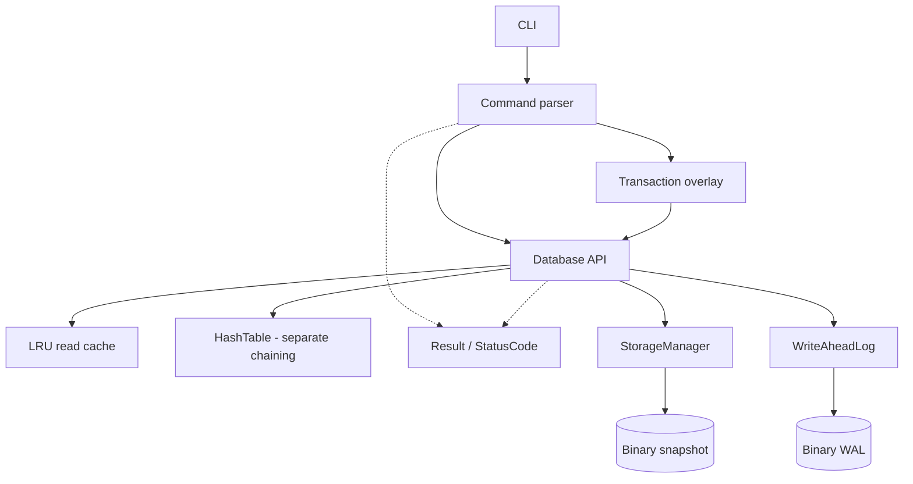

# MiniDB

An educational persistent key-value database engine built from scratch in modern C++20.

MiniDB is a learning project. It develops the mechanisms a real storage engine
depends on — a hash table, a binary on-disk format, a write-ahead log, crash
recovery, an LRU cache, single-process transactions, and thread-safe library access — at a size that can
be read and understood in an afternoon. It is not a production database, and the
[Limitations](#limitations) section says plainly what it does not do.

> **Current state:** MiniDB stores data on disk and reloads it on startup.
> Individual mutations and committed transactions are logged and flushed to the OS before changing memory.
> Startup loads the snapshot and replays only WAL operations newer than its checkpoint. Power-loss durability is not provided.
> Calls on one `Database` are synchronized; this is a correctness design, not a scalability claim.

## Status

Built in milestones, each one a working program.

- [x] **Milestone 0** — build system, warning policy, test harness, CI
- [x] **Milestone 1** — in-memory database, command parser, interactive CLI
- [x] **Milestone 2** — custom hash table with separate chaining
- [x] **Milestone 3** — persistent binary snapshots with atomic replacement
- [x] **Milestone 4** — write-ahead log and startup replay
- [x] **Milestone 5** — checkpoint-aware crash recovery
- [x] **Milestone 6** — LRU read cache
- [x] **Milestone 7** — single-process transactions
- [x] **Milestone 8** — single-process concurrency and thread safety
- [x] **Milestone 9** — benchmarks and measured performance notes

## What works today

| Command | Behaviour |
| --- | --- |
| `SET <key> <value>` | Stores a value, replacing any existing one. The value may contain spaces. |
| `GET <key>` | Prints the value, or `NOT_FOUND`. |
| `DELETE <key>` | Removes a key. Prints `NOT_FOUND` if it was not there. |
| `EXISTS <key>` | Prints `true` or `false`. |
| `KEYS` | Lists every key, sorted. Prints `(empty)` when there are none. |
| `CLEAR` | Removes every key. |
| `BEGIN` | Starts a transaction. |
| `COMMIT` | Applies all transaction-local changes. |
| `ROLLBACK` | Discards all transaction-local changes. |
| `HELP` | Lists the commands. |
| `EXIT` | Saves and ends the session. End-of-input works too. |

Command names are case-insensitive; keys and values are not. The database is
recovered at startup; mutations are logged immediately and a snapshot is saved on exit.

## Requirements

- A C++20 compiler and standard library with `std::jthread`, `std::latch`,
  `std::shared_mutex`, and the other C++20 facilities used by the project
- CMake 3.20 or newer

CI builds current GCC and Clang configurations. The Windows build is verified
with Visual Studio 2026 / MSVC 19.51.

MiniDB has no third-party dependencies. It configures and builds offline.

## Quick start

```bash
cmake -S . -B build
cmake --build build
ctest --test-dir build --output-on-failure
```

Then start a session:

```bash
./build/minidb
```

On Windows with Visual Studio 2026, use the multi-config generator and select
the same configuration when building, testing, and running:

```powershell
cmake -S . -B build -G "Visual Studio 18 2026" -A x64
cmake --build build --config Debug --parallel
ctest --test-dir build -C Debug --output-on-failure
.\build\Debug\minidb.exe
```

MiniDB keeps its database in your user data directory
(`%LOCALAPPDATA%\MiniDB\minidb.snapshot` on Windows,
`$XDG_DATA_HOME/minidb/minidb.snapshot` elsewhere). Pass a path to use a
different file:

```bash
./build/minidb ./scratch.snapshot
```

### Build options

| Option | Default | Effect |
| --- | --- | --- |
| `MINIDB_BUILD_TESTS` | `ON` | Build the test suite |
| `MINIDB_BUILD_BENCHMARKS` | `ON` | Build the standalone benchmark executable |
| `MINIDB_WARNINGS_AS_ERRORS` | `OFF` | Fail the build on any compiler warning (CI sets this to `ON`) |

For a release build:

```bash
cmake -S . -B build -DCMAKE_BUILD_TYPE=Release
cmake --build build
```

## Example session

```text
$ ./build/minidb
MiniDB v0.1.0
Database: /home/user/.local/share/minidb/minidb.snapshot
New database: nothing saved here yet.
Type HELP for the command list.

MiniDB> SET name Aarya
OK

MiniDB> GET name
Aarya

MiniDB> SET name Aarya Lalan
OK

MiniDB> GET name
Aarya Lalan

MiniDB> SET age 18
OK

MiniDB> KEYS
age
name

MiniDB> EXISTS age
true

MiniDB> DELETE age
OK

MiniDB> GET age
NOT_FOUND

MiniDB> GET
INVALID_ARGUMENT: GET requires a key

MiniDB> FROBNICATE x
INVALID_ARGUMENT: unknown command 'FROBNICATE'; type HELP for the list

MiniDB> EXIT
Goodbye!
```

## Persistence

Data survives restarts. The whole database is written to a binary snapshot
when the session ends, and read back when it starts:

```text
$ ./build/minidb ./demo.snapshot
MiniDB> SET name Aarya
OK
MiniDB> SET language C++
OK
MiniDB> EXIT
Goodbye!

$ ./build/minidb ./demo.snapshot
MiniDB v0.1.0
Database: ./demo.snapshot
Loaded 2 entries.
Type HELP for the command list.

MiniDB> GET name
Aarya
MiniDB> GET language
C++
```

**How it works.** Saving writes every record to a temporary file beside the
database, then renames it over the original in one filesystem operation, so a
reader never sees a half-written file. The format is documented byte by byte
in [docs/STORAGE_FORMAT.md](docs/STORAGE_FORMAT.md).

**Recovery.** Each mutation is appended to `<snapshot>.wal` and flushed to the
OS before changing memory. Startup loads the snapshot and replays only WAL operations newer than its checkpoint.
An incomplete final record is trimmed; complete corrupt records are refused.
Saving installs the complete snapshot before resetting the WAL. See
[WAL format and recovery policy](docs/WAL.md), including tail-repair ambiguity.

**Durability limits.** Successful flushes support recovery after process
termination while the OS remains healthy. MiniDB does not call `fsync` or
`FlushFileBuffers`, and does not guarantee recovery after power loss or OS
failure. This educational single-process database has no distributed recovery or
multi-process coordination. No full ACID or production-grade guarantees are claimed.

For example: snapshot `a=1,b=2` → log `DELETE a; SET c 3` → restart →
load snapshot → replay newer records → recover exactly `b=2,c=3`.
Snapshots now include a checksum-protected checkpoint, so a restart between
snapshot replacement and WAL reset skips operations already saved. Legacy
version-1 snapshots remain readable; the next save upgrades them to version 2.

## Architecture



Solid arrows show calls and data flow; dashed arrows show components sharing
the common `Result` error model.

Each component has one job:

- **`cli/main.cpp`** — reads lines, prints replies, and nothing else. It owns
  the wording of `OK`, `true`/`false` and the sorted `KEYS` output.
- **`command_parser`** — turns a line of text into a `Command`, or into a
  `Result` explaining why it is not one. Stateless free function.
- **`Database`** — stores the data. Knows nothing about terminals or syntax.
- **`Transaction`** — holds an active transaction's final per-key changes until commit.
- **`HashTable`** — MiniDB's own hash table, described below. Knows nothing
  about keys being strings or values being database entries.
- **`StorageManager`** — turns records into bytes and back, and owns every
  rule about what a valid snapshot is. Knows nothing about hash tables.
- **`WriteAheadLog`** — appends, validates, replays, and resets mutation records.

Both the parser and the database report problems through the same `Result` /
`StatusCode` pair from Milestone 0, so the CLI has one error model to render.

## LRU read cache

GET checks a 128-entry LRU cache first. A miss reads the authoritative in-memory
hash table and caches a successful result. SET/DELETE invalidate affected
entries; CLEAR and successful recovery clear the cache. The snapshot and WAL
formats are unchanged. Failed writes/recovery preserve the previous valid state.

The cache uses `std::unordered_map` plus a doubly linked `std::list`: average
O(1) lookup/PUT, O(1) list promotion and tail unlink, average O(1) map removal
for eviction. Hash collisions/rehash and string hashing/copying add costs;
these bounds are in entry count, not bytes. Clear is O(C), size/capacity O(1).

Library callers can use `Database(0)` or `Database(path, 0)` to disable caching,
or supply another entry capacity. `cache_size()` and `cache_capacity()` expose
read-only diagnostics. Existing constructors and const GET remain supported.

This is an educational cache over data already in RAM, not a disk-page cache
or a measured performance improvement. It duplicates values, has no byte-budget
eviction, and leaves snapshot/WAL I/O complexity unchanged. Database protects
cache recency with a dedicated mutex.
See [Learning notes](docs/LEARNING_NOTES.md) for an access-order example.

## Transactions

`BEGIN` creates a transaction-local overlay. `SET` stores a value in that
overlay, `DELETE` stores a tombstone, and `GET` checks the overlay before the
database, so a transaction reads its own writes. The main database and its WAL
are unchanged until `COMMIT`. `ROLLBACK`, `EXIT`, or end-of-input discards the
overlay.

`COMMIT` collapses repeated changes to each key, builds a complete replacement
table, appends all final mutations as one checksummed transaction WAL record,
and then publishes the table. Recovery accepts the record only when its whole
header, payload, and checksum are valid, and replays all enclosed changes with
one sequence number. A truncated final transaction record is discarded in full,
so recovery never exposes only part of that transaction. An empty transaction
commits without writing a WAL record.

The cache may serve or populate unchanged values during a transaction. Local
writes never enter it. Successful commit clears the cache after publishing the
new table; rollback leaves valid cached data alone.

This gives logical all-or-nothing application within this single process and
during WAL recovery. It does not provide full ACID durability: stream flush is
not a device barrier, and an I/O error while appending can leave the commit
outcome uncertain until the database is reopened. There is one transaction
coordinator per CLI session and no MVCC, conflict detection, repeatable-read
guarantee, or advanced isolation level. See [Transaction design](docs/TRANSACTIONS.md).

## Concurrency model

Ordinary calls on one `Database` are thread-safe. A database-level
`std::shared_mutex` lets GET, EXISTS, KEYS, size, and other read-only state
operations overlap. SET, DELETE, CLEAR, recovery, save, and transaction commit
take its exclusive lock. A separate `std::mutex` protects LRU membership and
recency; every path that needs both locks takes the database lock first.

Each `Transaction` has its own mutex, so calls on the same transaction object
cannot race. Independent transaction objects may coexist and their commits are
serialized by Database, but they have no snapshot isolation or conflict
detection. A transaction may observe commits made after its BEGIN.

Long snapshot, recovery, WAL, and commit work holds the exclusive database
lock, so it blocks all other operations. Cache hits briefly serialize on the
cache mutex. Separate Database objects that point to the same files are not
coordinated. The low-level HashTable, LruCache, StorageManager, and
WriteAheadLog types require caller synchronization when used directly. See
[Concurrency](docs/CONCURRENCY.md) for the full contract and lock order.

## The hash table

Since Milestone 2, storage is MiniDB's own `HashTable<Key, Value, Hash>` rather
than `std::unordered_map`. A key reaches its bucket like this:

```text
key ──► Hash{}(key) ──► std::size_t hash ──► hash % bucket_count ──► bucket index
```

Keys that land on the same index are kept in a singly linked chain hanging off
that bucket — **separate chaining**. A collision costs extra key comparisons
and never loses data.

| Property | Choice | Reason |
| --- | --- | --- |
| Collision strategy | Separate chaining | Deletion is a simple unlink; open addressing needs tombstones |
| Bucket counts | Primes: 17, 37, 79, 163, ... | `std::hash<int>` is the identity in libstdc++, so power-of-two counts would collide badly on ordinary integer keys |
| Max load factor | 0.75 | Keeps the expected chain under one node without wasting a large array |
| Growth | Doubling, then round up to a prime | Makes insertion amortised O(1); fixed-size growth would be O(n²) overall |
| Node storage | `std::unique_ptr` chains | Explicit ownership, no leaks, no raw owning pointers |
| Hash caching | Stored per node | Rehashing recomputes only a remainder, never re-hashes a key |

Two properties worth knowing:

- **Pointers survive a rehash.** Growing relinks existing nodes rather than
  recreating them, so a pointer from `find()` stays valid. Only erasing that
  entry or clearing the table invalidates it.
- **Teardown is iterative.** Destroying a chain through its head `unique_ptr`
  would recurse once per node and exhaust the stack on a long chain, so
  `clear()` unlinks each node before releasing it. There is a test that builds
  a 20,000-node chain to prove it.

## Complexity

As provided by `HashTable`:

| Operation | Complexity |
| --- | --- |
| `SET` | Average O(1), worst case O(n) |
| `GET` | Average O(1), worst case O(n) |
| `DELETE` | Average O(1), worst case O(n) |
| `EXISTS` | Average O(1), worst case O(n) |
| `KEYS` | O(n) |
| `CLEAR` | O(n) |
| Transaction `GET`/`SET`/`DELETE` | Average O(1) overlay work, plus underlying lookup when needed |
| `COMMIT` | O(n + t log t + transaction bytes) |
| `ROLLBACK` | O(t) |
| `size` | O(1) |
| Loading a snapshot | O(n) time, O(n) memory |
| Saving a snapshot | O(n) time |

Persistence is not O(1) in any form: saving and loading each touch every
record. Plus, on the table itself: `rehash` is O(n), and space is O(n + bucket_count).

These averages are **expected** values, not guarantees. They hold on two
conditions: the hash spreads keys evenly, and the load factor stays bounded.
MiniDB enforces the second by rehashing at 0.75 and delegates the first to
`std::hash`. The worst case is every key colliding into one bucket, which turns
the table into a linked list — the test suite reproduces this deliberately
rather than assuming it cannot happen.

`KEYS` as printed by the CLI is O(n log n), because the CLI sorts for readable
output; `Database::keys()` itself is O(n).

## Testing

Every test file compiles to its own executable and registers as its own CTest
test, so one crashing test cannot take down the rest of the suite.

```bash
ctest --test-dir build --output-on-failure
```

To run a single test verbosely:

```bash
ctest --test-dir build -R test_database -V
```

| Suite | Covers |
| --- | --- |
| `test_recovery` / `test_recovery_process` | Checkpoints, legacy files, malformed recovery inputs, truncated tails, abrupt subprocess exit and CLI restart |
| `test_lru_cache` | Recency, eviction, zero/one capacity, copy/move safety, mixed-operation model, Database invalidation and recovery |
| `test_transaction` / `test_transaction_cli` | Local visibility, commit/rollback, WAL batching and torn records, cache interaction, restart persistence, command errors |
| `test_concurrency` | Concurrent reads/writes, LRU consistency, shared Transaction access, serialized commits, save/WAL/recovery interaction |
| `test_wal` | Binary encoding, replay, torn tails, corruption, length limits, failed I/O, snapshot/reset ordering, restart recovery |
| `test_storage` | Round trips, corrupt magic, bad version, truncation at every offset, invalid lengths, overflow attempts, duplicate keys, checksum failures, scratch-file cleanup |
| `test_hash_table` | Insert, lookup, update, erase, clear, resizing, forced collisions, chain surgery, rehash preservation, value semantics |
| `test_database` | Every operation, empty state, overwrites, size limits, binary values, 1000-key stress |
| `test_command_parser` | Every command, spaces in values, case handling, missing and extra arguments, unknown commands |
| `test_result` | The `Result` / `StatusCode` error model |

Tests use a small in-repo framework (`tests/test_framework.hpp`) rather than a
third-party library. The reasoning is in
[docs/DESIGN_DECISIONS.md](docs/DESIGN_DECISIONS.md).

## Performance and benchmarks

`minidb_benchmark` measures SET, GET, DELETE, mixed SET/GET, warmed cache-hit
GET, and raw `HashTable`/`std::unordered_map` workloads at 1,000, 10,000, and
100,000 operations. It uses `std::chrono::steady_clock` and reports the median
of five Release-build trials as elapsed time, operations per second, and
average nanoseconds per operation.

```bash
cmake -S . -B build-bench -DCMAKE_BUILD_TYPE=Release
cmake --build build-bench --target minidb_benchmark
./build-bench/minidb_benchmark
```

The benchmark uses an in-memory database and is not part of CTest. See
[Benchmark methodology and measured results](docs/BENCHMARKS.md) for the exact
environment, numbers, interpretation, and limitations. Results vary by
hardware, compiler, build settings, power mode, and system load; they are not
a claim that MiniDB outperforms production databases.

## Limitations

As of Milestone 9, MiniDB does **not**:

- Guarantee durability against power loss. Saves are not `fsync`ed.
- Update the snapshot incrementally. Every save rewrites the whole file, so
  saving is O(n) however small the change.
- Coordinate between processes. There is no locking, and two MiniDB processes
  on one database will overwrite each other.
- Provide snapshot isolation, MVCC, conflict detection, or advanced isolation levels.
- Coordinate separate Database instances that point at the same snapshot/WAL files.
- Promise high write scalability; writes and persistence operations use one exclusive lock.
- Guarantee the outcome of a commit whose WAL append reports an I/O error;
  reopen and recover the database before deciding what became durable.
- Allow spaces in keys, since arguments are whitespace-separated.
- Allow an empty value from the CLI, though `Database::set` accepts one.

And it is not intended to ever implement:

- SQL, or any query language beyond simple key-value commands
- A network protocol or client/server mode
- Replication, sharding, or any distributed behaviour
- A query planner or optimiser
- Full ACID isolation between concurrent transactions
- Multi-process coordination

## Maintenance roadmap

Milestone 9 completes the planned feature set. Future work is limited to
portability fixes, confirmed bug fixes, focused regression tests, and keeping
the documentation aligned with the implementation. The larger database
subsystems listed above remain intentionally outside this project's scope.

## Documentation

- [WAL format and recovery](docs/WAL.md) — mutation records, durability, and limitations
- [Transactions](docs/TRANSACTIONS.md) — lifecycle, visibility, WAL/cache interaction, and guarantees
- [Concurrency](docs/CONCURRENCY.md) — protected state, lock modes, ordering, and limitations
- [Benchmarks](docs/BENCHMARKS.md) — methodology, measured results, interpretation, and limitations
- [Storage format](docs/STORAGE_FORMAT.md) — the snapshot layout, byte by byte
- [Design decisions](docs/DESIGN_DECISIONS.md) — why things are built the way they are
- [Learning notes](docs/LEARNING_NOTES.md) — the concepts behind the code, explained from scratch

## License

[MIT](LICENSE)
