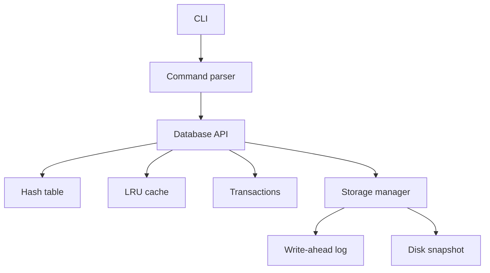

# MiniDB

An educational persistent key-value database engine built from scratch in modern C++20.

MiniDB is a learning project. It implements the mechanisms a real storage engine
depends on — a hash table, a binary on-disk format, a write-ahead log, crash
recovery, an LRU cache, transactions and thread-safe access — at a size that can
be read and understood in an afternoon. It is not a production database, and the
[Limitations](#limitations) section says plainly what it does not do.

## Status

Under active development, built in milestones. Completed so far:

- [x] **Milestone 0** — build system, warning policy, test harness, CI
- [ ] Milestone 1 — basic database and CLI commands
- [ ] Milestone 2 — custom hash table
- [ ] Milestone 3 — persistence
- [ ] Milestone 4 — write-ahead log
- [ ] Milestone 5 — crash recovery
- [ ] Milestone 6 — LRU cache
- [ ] Milestone 7 — transactions
- [ ] Milestone 8 — concurrency
- [ ] Milestone 9 — benchmarks

## Planned architecture



The command-line front end and the engine are separate build targets.
`minidb_core` holds all database logic and knows nothing about terminals;
`minidb` is a thin executable over it. The tests link against the same library
the CLI does.

## Requirements

- A C++20 compiler: GCC 10+, Clang 12+, or MSVC 19.29+ (Visual Studio 2019 16.10+)
- CMake 3.20 or newer

MiniDB has no third-party dependencies. It configures and builds offline.

## Quick start

```bash
cmake -S . -B build
cmake --build build
ctest --test-dir build --output-on-failure
```

Run the binary against a data directory:

```bash
./build/minidb ./data
```

### Build options

| Option | Default | Effect |
| --- | --- | --- |
| `MINIDB_BUILD_TESTS` | `ON` | Build the test suite |
| `MINIDB_WARNINGS_AS_ERRORS` | `OFF` | Fail the build on any compiler warning (CI sets this to `ON`) |

For a release build:

```bash
cmake -S . -B build -DCMAKE_BUILD_TYPE=Release
cmake --build build
```

## Project layout

```text
include/minidb/   Public headers — the engine interface
src/              Engine implementation
cli/              Command-line front end
tests/            Test suite, one executable per file, run through CTest
docs/             Design notes and engineering documentation
```

## Testing

Every test file compiles to its own executable and registers as its own CTest
test, so one crashing test cannot take down the rest of the suite.

```bash
ctest --test-dir build --output-on-failure
```

To run a single test verbosely:

```bash
ctest --test-dir build -R test_result -V
```

Tests use a small in-repo framework (`tests/test_framework.hpp`) rather than a
third-party library. The reasoning is recorded in
[docs/DESIGN_DECISIONS.md](docs/DESIGN_DECISIONS.md).

## Limitations

MiniDB deliberately does **not** implement:

- SQL, or any query language beyond simple key-value commands
- A network protocol or client/server mode
- Replication, sharding, or any distributed behaviour
- A query planner or optimiser
- Full ACID isolation between concurrent transactions
- Multi-process coordination — one process at a time owns a data directory

## Documentation

- [Design decisions](docs/DESIGN_DECISIONS.md)

## License

[MIT](LICENSE)
